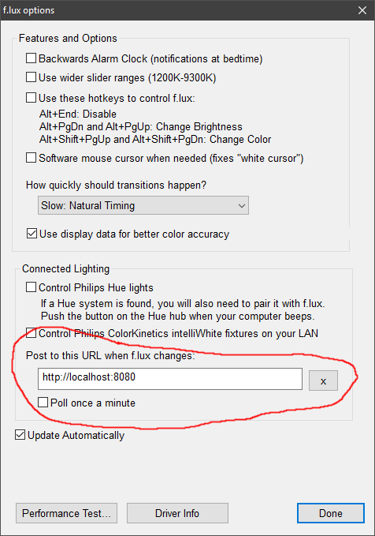

## flux-tplink-smart-bulbs

A script to change the TP Link Smart Bulbs according to [f.lux](https://justgetflux.com/)

Uses Konsumer's [tplink-lightbulb API](https://github.com/konsumer/tplink-lightbulb)

First you will need to set the bulbs IP address in the server.js, You can find this using your router or the scan command on Konsumer's tplink-lightbulb API.

You then need to run the server.js using``` node server.js ```and go to f.lux options and set the post to this url setting in the connected lighting section to http://localhost:8080

This can be run off a separate computer too, I had it running on a Raspberry PI.

Seen here:



I do recommend using [nodemon](https://github.com/remy/nodemon#nodemon) instead to run the server.js like this``` nodemon server.js ```as it will automatically restart after you change the code.

This has been tested using an LB130 but should work for any of the bulbs listed in Konsumer's README.